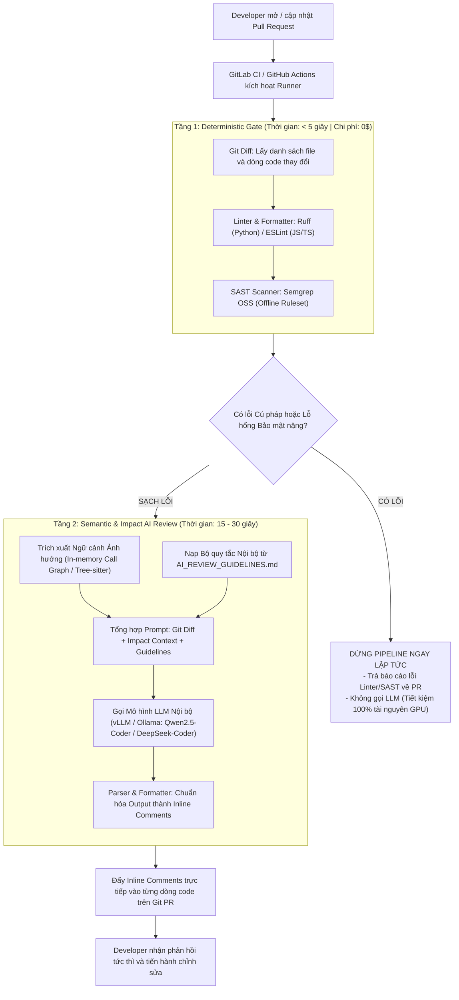
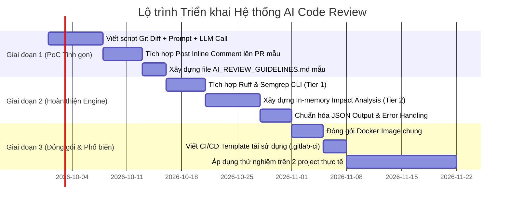

# ĐỀ XUẤT KIẾN TRÚC HỆ THỐNG AI CODE REVIEW NỘI BỘ (IN-HOUSE & ON-PREMISE)

> **Mục tiêu:** Xây dựng giải pháp tự động hóa Code Review bằng AI tích hợp vào quy trình CI/CD nội bộ của doanh nghiệp. Hệ thống được thiết kế theo tiêu chí **100% On-Premise / Zero 3rd-Party SaaS**, bảo mật tuyệt đối mã nguồn, không phát sinh chi phí duy trì cụm server riêng biệt (Zero-Server Overhead), và tối ưu thời gian phản hồi cho lập trình viên.

---

## 1. Đánh giá Khách quan & Định hướng Chuyển đổi Kiến trúc

Bản đề xuất sơ khởi ban đầu (sử dụng Neo4j + Vector DB + ReAct Agent) có ý tưởng tốt về mặt **Impact Analysis (Phân tích ảnh hưởng dây chuyền)**, nhưng tồn tại các rào cản lớn khi áp dụng vào môi trường doanh nghiệp nội bộ:

| Tiêu chí                                  | Kiến trúc Sơ khởi (Neo4j + VectorDB)                                      | Rủi ro trong môi trường Doanh nghiệp                                                                             | Định hướng Kiến trúc Mới (Tinh gọn & Thực tế)                                                                                        |
| :---------------------------------------- | :------------------------------------------------------------------------ | :--------------------------------------------------------------------------------------------------------------- | :----------------------------------------------------------------------------------------------------------------------------------- |
| **Hạ tầng (Infrastructure)**              | Cần duy trì cụm Neo4j Server + Vector DB Server 24/7.                     | Tăng gánh nặng vận hành cho DevOps; tốn tài nguyên server; nguy cơ downtime DB làm nghẽn toàn bộ CI/CD.          | **Zero-Server (Ephemeral Container):** Toàn bộ công cụ đóng gói trong 1 Docker Image, chạy và giải phóng ngay trong CI Runner.       |
| **Phân tích Mã nguồn (Code Graph)**       | Parse AST bằng Tree-sitter rồi nạp vào Neo4j; sinh câu lệnh Cypher tự do. | AST đơn thuần không giải quyết được Call Graph / Type Inference; Text-to-Cypher dễ hallucinate và treo truy vấn. | **In-memory Graph + Static Indexer:** Dùng Tree-sitter + `networkx` trong RAM hoặc LSP / Pyright CLI để tìm callers/callees tức thì. |
| **Quản lý Quy chuẩn (Guidelines)**        | Đưa file guidelines vào Vector DB để làm RAG.                             | Chunking làm đứt gãy ngữ cảnh quy tắc chéo; tăng thêm 1 DB dependency không cần thiết cho 1 file tài liệu ngắn.  | **System Prompt Structuring:** Nạp trực tiếp guidelines vào System Prompt của LLM theo từng tag/domain tương ứng với PR.             |
| **Phân bổ Trách nhiệm (Task Delegation)** | Dùng LLM bắt cả lỗi Syntax, PEP 8, Naming convention.                     | Chậm, tốn chi phí token/GPU nội bộ, dễ báo lỗi giả (false positives).                                            | **2-Tier Pipeline:** Tách lớp Deterministic (Linter/SAST miễn phí) và lớp Semantic (AI chỉ review logic/kiến trúc).                  |
| **Bảo mật & Bên thứ 3**                   | Nguy cơ phụ thuộc vào các dịch vụ SaaS bên ngoài.                         | Vi phạm chính sách bảo mật mã nguồn và IP của doanh nghiệp.                                                      | **100% In-house / Self-hosted:** Dùng tool Open-Source CLI + LLM On-Premise (hoặc Private Gateway).                                  |

---

## 2. Kiến trúc Tổng thể: Mô hình Phân tầng (2-Tier Pipeline)

Quy trình được đóng gói hoàn toàn trong một **Ephemeral Docker Container** chạy trên GitLab CI Runner hoặc GitHub Actions Runner nội bộ:



---

## 3. Thiết kế Kỹ thuật Chi tiết (4 Giai đoạn)

### Giai đoạn 1: Deterministic Gate (Kiểm tra Cố định Cục bộ)

Không sử dụng LLM cho các tác vụ kiểm tra cú pháp và định dạng. Tầng này chạy các công cụ CLI mã nguồn mở, offline hoàn toàn:

1. **Linter & Formatter:**
   - **Python:** Sử dụng `ruff` (viết bằng Rust, tốc độ siêu tốc < 50ms, thay thế hoàn toàn `flake8`, `black`, `isort`).
   - **JavaScript/TypeScript:** Sử dụng `eslint` + `prettier`.
2. **Static Application Security Testing (SAST):**
   - Sử dụng **Semgrep OSS** ở chế độ offline (`semgrep scan --config p/security-audit --config p/owasp-top-ten`).
   - Bắt triệt để các lỗi: Hardcoded Secrets, SQL Injection, Command Injection, XSS cơ bản.
3. **Cơ chế Fail-fast:** Nếu tầng này phát hiện lỗi, pipeline dừng ngay và gửi phản hồi cho Dev. LLM sẽ **không** được kích hoạt.

---

### Giai đoạn 2: Phân tích Ảnh hưởng Dây chuyền (In-Memory Impact Analysis)

Thay vì duy trì cơ sở dữ liệu đồ thị Neo4j cồng kềnh, phân tích phụ thuộc được thực hiện ngay trong bộ nhớ RAM của CI runner:

1. **Xác định Vùng thay đổi:**
   - Dùng lệnh `git diff origin/main...HEAD` để bóc tách các file, class, và hàm vừa được thêm mới hoặc chỉnh sửa.
2. **Xây dựng Đồ thị Cục bộ (In-memory Call Graph):**
   - Dùng **Tree-sitter** kết hợp thư viện đồ thị Python `networkx` để parse AST của các file liên quan.
   - Hoặc dùng công cụ index symbol tĩnh như **Universal Ctags** / **Pyright CLI** để truy vết:
     - _Hàm `process_data()` bị sửa đổi ở PR này đang được gọi bởi những hàm/file nào khác?_
     - _Chữ ký hàm (signature) có bị thay đổi gây breaking change ở các module phụ thuộc không?_
3. **Đóng gói Ngữ cảnh (Context Packing):**
   - Chỉ trích xuất phần code của các hàm caller/callee bị ảnh hưởng trực tiếp (tối đa 1-2 bậc) để đưa vào context của LLM. Tránh nhồi toàn bộ codebase làm loãng sự chú ý của mô hình.

---

### Giai đoạn 3: Quản lý và Tinh lọc Bộ Tiêu chuẩn (`AI_REVIEW_GUIDELINES.md`)

Tài liệu hướng dẫn được lưu trữ trực tiếp trong repository, được kiểm soát phiên bản qua Git:

1. **Không dùng Vector DB:** Toàn bộ nội dung file được đọc trực tiếp và tích hợp vào **System Prompt** của LLM.
2. **Phân vùng Tiêu chuẩn (Tagged Guidelines):**
   - Chỉ nạp các quy tắc liên quan đến loại file thay đổi (ví dụ: PR chỉ sửa migration/database thì chỉ nạp quy tắc nhóm `[DATABASE]`, không nạp quy tắc nhóm `[FRONTEND]`).
3. **Cấu trúc Tiêu chuẩn (Format Chuẩn hóa):**
   Mỗi quy tắc bắt buộc phải có đủ 4 yếu tố:
   ```markdown
   ### [RULE-DB-01] Bắt buộc sử dụng Soft Delete cho các Entity cốt lõi

   - **Mô tả:** Không bao giờ gọi hàm `.delete()` trực tiếp trên các model tài chính/người dùng; phải cập nhật trường `is_deleted = True` hoặc `deleted_at`.
   - **Lý do:** Đảm bảo khả năng kiểm toán (audit trail) và phục hồi dữ liệu khi có sự cố.
   - **Bad:**
     user = User.objects.get(id=user_id)
     user.delete()
   - **Good:**
     user = User.objects.get(id=user_id)
     user.soft_delete(deleted_by=request.user)
   ```

---

### Giai đoạn 4: Điều phối Review & Tích hợp Git Nội bộ

1. **Lựa chọn Mô hình LLM (Đảm bảo Không Leak Code):**
   - **Phương án Khuyến nghị (On-Premise GPU):** Triển khai server suy luận nội bộ bằng **vLLM** hoặc **Ollama**.
     - Model ưu tiên: `Qwen2.5-Coder-32B-Instruct` (chất lượng review tương đương GPT-4o, hỗ trợ tiếng Anh & tiếng Việt tốt).
     - Model cho phần cứng vừa phải: `Qwen2.5-Coder-14B-Instruct` hoặc `DeepSeek-Coder-V2-Lite`.
   - **Phương án Doanh nghiệp (Private Enterprise Cloud Gateway):** Nếu công ty có tài khoản Azure OpenAI / GCP Vertex AI với thỏa thuận pháp lý **Zero Data Retention** (dữ liệu không bị lưu trữ hay dùng để train model).
2. **Định dạng Output (Structured Output):**
   - Yêu cầu LLM trả kết quả theo chuẩn **JSON Schema** nghiêm ngặt:
     ```json
     [
       {
         "file_path": "src/services/payment.py",
         "line_number": 42,
         "severity": "CRITICAL",
         "rule_id": "RULE-SEC-03",
         "comment": "Phát hiện thiếu Database Transaction khi thực hiện chuyển tiền. Nếu bước trừ tiền thành công nhưng bước ghi log thất bại, dữ liệu sẽ bị mất đồng bộ.",
         "suggestion": "Bọc khối code này trong `with transaction.atomic():`"
       }
     ]
     ```
3. **Post Inline Comments:**
   - Script CI đọc mảng JSON và gọi API của Git Platform nội bộ (GitLab REST API: `/projects/:id/merge_requests/:mr_id/discussions` hoặc GitHub Enterprise Pull Request Review API).
   - Comment được ghim chính xác vào từng dòng code vi phạm trên giao diện web của PR.

---

## 4. Công nghệ Đề xuất (Tech Stack Nội bộ Tinh gọn)

| Lớp thành phần           | Công nghệ Đề xuất                                       | Trạng thái Bản quyền & Bảo mật                             |
| :----------------------- | :------------------------------------------------------ | :--------------------------------------------------------- |
| **CI/CD Platform**       | GitLab CI / GitHub Actions Self-Hosted Runner           | Hệ thống sẵn có của công ty.                               |
| **Container Engine**     | Docker / Kaniko                                         | Đóng gói môi trường thực thi độc lập.                      |
| **Linter & Formatter**   | `ruff` (Python) / `eslint` (Node.js)                    | Mã nguồn mở (MIT / Apache), chạy offline 100%.             |
| **SAST Engine**          | `semgrep` CLI (OSS)                                     | Mã nguồn mở (LGPL), chạy offline với rule chuẩn.           |
| **AST & Dependency**     | `tree-sitter`, `networkx`, `universal-ctags`            | Thư viện Python cục bộ, xử lý in-memory.                   |
| **LLM Inference Engine** | **vLLM** hoặc **Ollama** (chạy trên máy chủ GPU nội bộ) | Mã nguồn mở, quản lý và scale model tự host.               |
| **Foundation Model**     | `Qwen2.5-Coder-32B-Instruct` / `14B`                    | Open-weights, thương mại hóa tự do, chuyên sâu về Code.    |
| **Git API Client**       | `python-gitlab` / `PyGithub`                            | Giao tiếp nội bộ qua Git Personal Access Token / CI Token. |

---

## 5. Lộ trình Triển khai từ "Hàng Mẫu" (PoC) đến Toàn Doanh Nghiệp

Để đảm bảo dự án thành công mà không bị sa đà vào bẫy kỹ thuật, lộ trình được chia thành 3 giai đoạn rõ rệt:



### Bước 1: Xây dựng MVP trên Project Hiện tại (Thời gian: ~1–2 tuần)

- Không cài đặt database ngoài.
- Viết 1 script Python `review_pr.py`:
  1. Lấy Git diff qua lệnh git CLI.
  2. Đọc file `AI_REVIEW_GUIDELINES.md`.
  3. Gửi prompt tới endpoint LLM (vLLM hoặc Ollama nội bộ).
  4. Đẩy comment lên PR để kiểm chứng độ hữu ích của nội dung review.

### Bước 2: Bổ sung Tier 1 Linter & In-memory Context (Thời gian: ~1–2 tuần)

- Thêm bước chạy `ruff` và `semgrep`. Nếu có lỗi, fail ngay lập tức.
- Bổ sung parser Tree-sitter để trích xuất thêm các hàm liên quan trực tiếp đến hàm vừa sửa.

### Bước 3: Đóng gói Docker & Phổ biến Toàn Doanh nghiệp (Thời gian: ~1 tuần)

- Đóng gói toàn bộ script, ruleset của Semgrep, và các công cụ vào 1 Docker image duy nhất (ví dụ: `registry.mycompany.com/devops/ai-code-reviewer:latest`).
- Tạo một file mẫu `.gitlab-ci.yml` (hoặc GitHub Action Reusable Workflow). Bất kỳ team nào trong công ty muốn dùng chỉ cần include 3–5 dòng cấu hình vào pipeline CI là hoàn tất.
