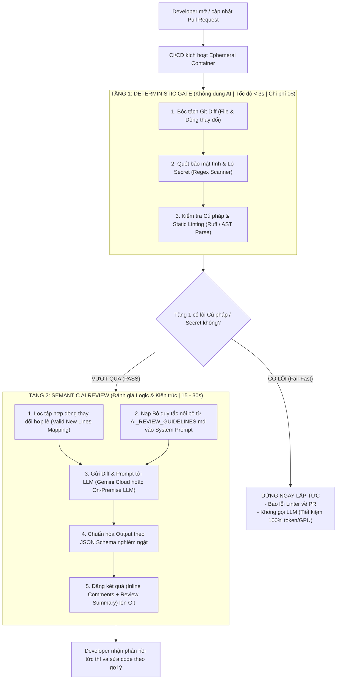

# TÀI LIỆU THIẾT KẾ KIẾN TRÚC & HƯỚNG DẪN TRIỂN KHAI HỆ THỐNG AI CODE REVIEW (CI/CD)

> **Mục tiêu:** Xây dựng hệ thống tự động hóa Code Review bằng AI tích hợp vào quy trình CI/CD (GitHub Actions / GitLab CI). Hệ thống giải phóng thời gian cho các Tech Lead/Mentor, bắt triệt để lỗi cú pháp, bảo mật và vi phạm quy chuẩn ngay khi tạo Pull Request (PR) trước khi con người vào duyệt nghiệp vụ cuối cùng.

---

## 1. Tổng quan Kiến trúc Hệ thống: Mô hình Phân tầng (2-Tier Pipeline)

Hệ thống được thiết kế theo triết lý **phân định ranh giới rõ ràng** giữa việc máy làm tốt nhất (deterministic) và việc AI làm tốt nhất (semantic), tránh lãng phí tài nguyên và loại bỏ hoàn toàn các lỗi ngớ ngẩn trước khi gọi LLM.



---

## 2. Thiết kế Chi tiết Tầng 1: Deterministic Gate (Kiểm tra Tĩnh & Cố định)

### 2.1. Tầng 1 hoạt động như thế nào?
1. **Lấy dữ liệu thay đổi:** Dùng lệnh git CLI (`git diff origin/main...HEAD`) hoặc Git API để bóc tách các file và khối code (hunks) vừa được thêm mới hoặc chỉnh sửa.
2. **Quét Secret & Dữ liệu nhạy cảm:** Chạy quét regex cục bộ để phát hiện ngay lập tức các API Key, Private Key, Token, Password bị hardcode trong source code.
3. **Kiểm tra Cú pháp & Static Analysis:**
   - Với Python: Chạy engine `ruff` (linter viết bằng Rust, tốc độ siêu tốc < 50ms) kết hợp `ast.parse` của Python chuẩn để phát hiện mọi lỗi cú pháp (`SyntaxError`), biến chưa định nghĩa, hoặc import lỗi.
   - Với JS/TS: Chạy `eslint --quiet`.
4. **Cơ chế Fail-Fast:** Nếu phát hiện bất kỳ lỗi cú pháp hoặc lộ secret nào, hệ thống lập tức xuất báo cáo lỗi và **dừng pipeline ngay**, không chuyển tiếp sang Tầng 2.

### 2.2. Làm sao để tin tưởng Tầng 1?
* **Tính tất định 100% (Deterministic):** Không phụ thuộc vào xác suất hay "ảo giác" (hallucination) như AI. Cú pháp sai là `ast.parse` và `ruff` bắt chính xác 100% dòng vi phạm theo chuẩn đặc tả của ngôn ngữ lập trình.
* **Thời gian thực thi tức thì (< 3 giây):** Toàn bộ quá trình chạy hoàn toàn offline trên CPU của CI runner, không mất thời gian gọi mạng.
* **Chi phí vận hành = 0$:** Không tốn bất kỳ 1 token LLM hay chu kỳ tính toán GPU nào cho các lỗi cú pháp ngớ ngẩn.

### 2.3. Các file cấu thành Tầng 1:
* `ci_agent/tier1_linter.py`: Engine điều phối kiểm tra cú pháp, quét regex secret và bắt lỗi fail-fast.
* `pyproject.toml` hoặc `.ruff.toml` (tùy chọn): Cung cấp các rule linter chuẩn của dự án.

---

## 3. Thiết kế Chi tiết Tầng 2: Semantic AI Review (Đánh giá Ngữ nghĩa & Kiến trúc)

### 3.1. Tầng 2 hoạt động như thế nào?
Tầng 2 chỉ kích hoạt khi Tầng 1 đã PASS sạch sẽ. Lúc này code đã chuẩn cú pháp, LLM chỉ tập trung vào việc con người cần: **Logic nghiệp vụ, bẫy tài nguyên, lỗ hổng logic, và vi phạm quy chuẩn dự án.**

1. **Mapping dòng code hợp lệ (Line Mapping):** Module `git_diff_extractor.py` bóc tách từng hunk của diff, lập danh sách tập hợp các số dòng thực tế được thêm mới hoặc chỉnh sửa (`valid_new_lines`).
2. **Nạp Bộ Quy Chuẩn Dự Án (`AI_REVIEW_GUIDELINES.md`):** Đọc trực tiếp nội dung file guidelines từ thư mục gốc của repository và nhúng thẳng vào **System Prompt** của LLM.
3. **Truy vấn LLM với Structured Output:** Yêu cầu mô hình phân tích diff theo tiêu chuẩn nội bộ và trả về mảng JSON có cấu trúc rõ ràng:
   ```json
   [
     {
       "file_path": "scripts/model.py",
       "line_number": 87,
       "severity": "CRITICAL",
       "rule_id": "RULE-ARCH-01",
       "comment": "Biến x_up bị gán bằng None dẫn đến lỗi TypeError khi đưa vào torch.cat ở dòng tiếp theo.",
       "suggestion": "# Xóa dòng x_up = None để duy trì Tensor x_up hợp lệ"
     }
   ]
   ```
4. **Xác thực dòng nhận xét (Line Guardrail):** Trước khi gửi lên Git, hệ thống kiểm tra `line_number` của từng comment. Nếu AI chỉ định một dòng nằm ngoài vùng diff, hệ thống sẽ tự động căn chỉnh về dòng hợp lệ gần nhất hoặc đưa vào báo cáo tổng quát, ngăn chặn hoàn toàn lỗi API từ GitHub/GitLab.
5. **Ghim Inline Comments:** Gọi API của Git Platform để tạo Pull Request Review, đính kèm comment và khối gợi ý code (`suggestion`) trực tiếp vào từng dòng vi phạm.

### 3.2. Các file cấu thành Tầng 2:
* `ci_agent/AI_REVIEW_GUIDELINES.md`: Bộ luật chuẩn hóa nội bộ của team (định dạng Rule, Bad, Good).
* `ci_agent/git_diff_extractor.py`: Trích xuất diff và parse ánh xạ dòng code hợp lệ.
* `ci_agent/gemini_reviewer.py`: Client giao tiếp với LLM và parse cấu trúc JSON.
* `ci_agent/github_poster.py`: Format báo cáo Markdown và gọi REST API đăng review.
* `ci_agent/main.py`: Entrypoint CLI điều phối toàn bộ workflow.

---

## 4. Phương án Chuyển Đổi sang LLM Local (On-Premise) Thay Vì Gemini Cloud

Nếu công ty có chính sách bảo mật khắt khe, **tuyệt đối không được gửi mã nguồn ra internet**, hệ thống có thể chuyển đổi sang chạy mô hình mã nguồn mở nội bộ 100% một cách dễ dàng mà không làm thay đổi kiến trúc tổng thể.

```
+--------------------------------------------------------------------------+
|  MÁY CHỦ GPU NỘI BỘ (ON-PREMISE)                                         |
|                                                                          |
|  [Hardware: 1x GPU RTX 3090 / 4090 (24GB) hoặc A10 / A100]               |
|                                                                          |
|  +--------------------------------------------------------------------+  |
|  | Inference Engine: vLLM hoặc Ollama (Docker Container)              |  |
|  | Model: Qwen2.5-Coder-14B / 32B-Instruct-AWQ (Hỗ trợ tốt Tiếng Việt)|  |
|  | Endpoint: http://llm-gateway.internal:8000/v1                      |  |
|  +--------------------------------------------------------------------+  |
+--------------------------------------------------------------------------+
                                  ▲
                                  │ (Giao thức HTTP OpenAI-Compatible)
                                  │
+--------------------------------------------------------------------------+
|  CI/CD RUNNER (GitLab Runner / GitHub Actions Runner Nội Bộ)             |
|                                                                          |
|  python -m ci_agent.main                                                 |
|    --base-url "http://llm-gateway.internal:8000/v1"                      |
|    --model "qwen2.5-coder-32b"                                           |
+--------------------------------------------------------------------------+
```

### 4.1. Phần cứng & Hạ tầng Yêu cầu:
* **GPU đề xuất:** 1x GPU Nvidia có VRAM từ **16GB – 24GB** (RTX 3090, RTX 4090, A10, L4).
* **RAM hệ thống:** 32GB – 64GB.

### 4.2. Khung suy luận (Inference Engine) & Mô hình khuyên dùng:
* **Engine:** Sử dụng **vLLM** (khuyên dùng cho production vì thông lượng cao, hỗ trợ PagedAttention) hoặc **Ollama** (setup cực nhanh, nhẹ).
* **Mô hình mã nguồn mở tốt nhất hiện nay:**
  1. `Qwen2.5-Coder-32B-Instruct` (bản lượng tử hóa AWQ/GPTQ chạy vừa vặn trên 1 GPU 24GB, năng lực review tương đương GPT-4o, hiểu tiếng Việt và tiếng Anh rất tốt).
  2. `Qwen2.5-Coder-14B-Instruct` (rất nhẹ, chạy mượt mà trên GPU 16GB VRAM, tốc độ suy luận nhanh).
  3. `DeepSeek-Coder-V2-Lite` (kiến trúc MoE, tiết kiệm tài nguyên).

### 4.3. Chuyển đổi mã nguồn trong hệ thống:
Cả `vLLM` và `Ollama` đều cung cấp sẵn giao diện REST API chuẩn **OpenAI-Compatible** (`/v1/chat/completions`). Do đó:
* Bạn chỉ cần thay đổi biến môi trường:
  * `LLM_BASE_URL="http://llm-gateway.internal:8000/v1"`
  * `LLM_MODEL="qwen2.5-coder-32b"`
  * `LLM_API_KEY="none"` (hoặc internal token)
* Toàn bộ logic bóc tách Git Diff, kiểm tra Tầng 1, và đăng comment của Tầng 2 **giữ nguyên 100% không cần viết lại**.

---

## 5. Hướng dẫn Triển khai: Từ "Hàng Mẫu" (PoC) đến "Scale Toàn Doanh Nghiệp"

### 5.1. Giai đoạn 1: Hàng mẫu (PoC tại repository hiện tại)
* Mục đích: Thử nghiệm thực tế luồng review, kiểm tra chất lượng comment và tinh chỉnh luật review.
* Cấu trúc: Thư mục `ci_agent/` và `.github/workflows/ai_code_review.yml` được đặt trực tiếp trong repository này để dev có thể sửa code và test ngay lập tức.

### 5.2. Giai đoạn 2: Chuẩn hóa cho Toàn Doanh Nghiệp (Centralized Engine)
> **CẢNH BÁO QUAN TRỌNG:** Khi triển khai cho hàng chục dự án trong công ty, **TUYỆT ĐỐI KHÔNG COPY** cả thư mục `ci_agent/` vào từng repo con (gây phân mảnh mã nguồn và cực hình khi bảo trì).

**Mô hình chuẩn Doanh nghiệp:**
1. Tạo một repository trung tâm duy nhất: `company-devops/ai-code-reviewer`.
2. Đóng gói toàn bộ code của `ci_agent` thành một **Docker Image chung** và đẩy lên Container Registry nội bộ:
   ```bash
   docker build -t registry.company.com/devops/ai-code-reviewer:latest .
   docker push registry.company.com/devops/ai-code-reviewer:latest
   ```
3. Khi đó, **mỗi dự án con trong công ty CHỈ CẦN 2 THÀNH PHẦN DUY NHẤT**:
   * **Thành phần 1:** File `AI_REVIEW_GUIDELINES.md` đặt ở thư mục gốc (chứa các quy tắc riêng của dự án đó).
   * **Thành phần 2:** File workflow CI/CD `.github/workflows/ai_review.yml` ngắn gọn chỉ ~10 dòng:
     ```yaml
     name: AI Code Review
     on:
       pull_request:
         types: [opened, synchronize, reopened]
     permissions:
       contents: read
       pull-requests: write
     jobs:
       review:
         runs-on: ubuntu-latest
         container:
           image: registry.company.com/devops/ai-code-reviewer:latest
         steps:
           - uses: actions/checkout@v4
             with:
               fetch-depth: 0
           - name: Execute Review
             env:
               GEMINI_API_KEY: ${{ secrets.GEMINI_API_KEY || vars.GEMINI_API_KEY }}
               GITHUB_TOKEN: ${{ secrets.GITHUB_TOKEN }}
             run: python -m ci_agent.main --pr "${{ github.event.pull_request.number }}" --repo "${{ github.repository }}"
     ```

---

## 6. Các Lưu Ý Sống Còn Khi Sử Dụng & Vận Hành (Gotchas & Best Practices)

Trong quá trình chạy thực tế, cần tuân thủ các nguyên tắc kỹ thuật sau để tránh lỗi hệ thống:

1. **Luôn dùng `event: "COMMENT"` khi gửi Review trên GitHub:**
   * **Lỗi kinh điển:** Gửi `event: "APPROVE"` từ GitHub Actions sẽ bị GitHub chặn với mã lỗi `422 Unprocessable Entity ("GitHub Actions is not permitted to approve pull requests")`.
   * **Quy ước:** Bot luôn gửi review với `event: "COMMENT"`. Kết luận duyệt (`✅ APPROVE` hay `❌ CHANGES REQUESTED`) được hiển thị bằng biểu tượng trực quan ngay trong nội dung báo cáo Markdown.
2. **Xử lý Pull Request chỉ có dòng Xóa (Deletions Only):**
   * Nếu PR chỉ xóa code (không có dòng thêm mới `+`), GitHub API không hỗ trợ ghim inline comment vào dòng không tồn tại ở file mới.
   * **Giải pháp:** Hệ thống vẫn gửi diff cho LLM đánh giá logic, nhưng toàn bộ nhận xét được gom vào thân bài **Review Summary** tổng quát.
3. **Cấu hình Secret cấp Repo vs Organization:**
   * Khi cấu hình API Key trên GitHub, phải tạo ở mục **Repository secrets** (không tạo ở tab *Variables* và không tạo ở *Environment secrets* nếu workflow không khai báo môi trường).
   * Workflow luôn sử dụng cú pháp `${{ secrets.KEY || vars.KEY }}` để phòng ngừa trường hợp dev tạo nhầm tab.
4. **Văn hóa phối hợp giữa Người và AI:**
   * AI là **người gác cổng sơ bộ (First-pass reviewer)**: Bắt lỗi cú pháp, leak tài nguyên, quên try-catch, lộ password, format mảng.
   * Mentor / Senior Developer là **người quyết định cuối cùng**: Đánh giá kiến trúc tổng thể, luồng nghiệp vụ phức tạp và phê duyệt Merge code.
