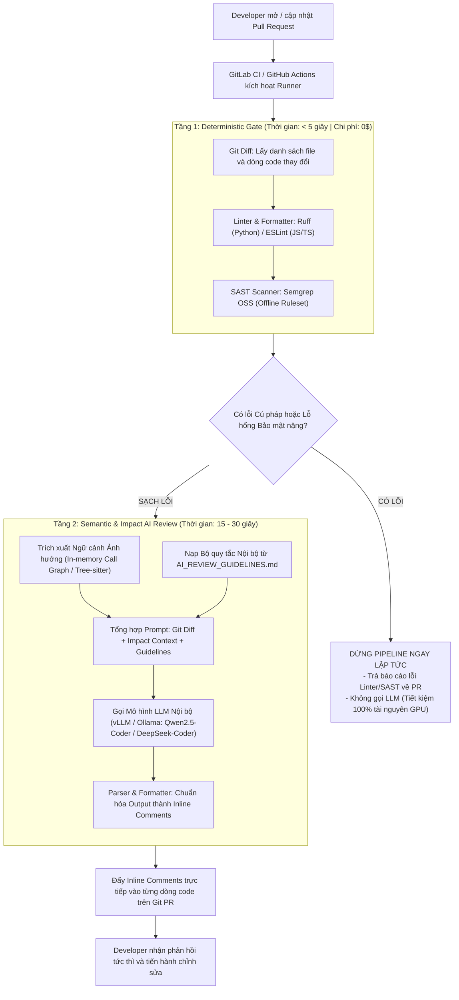
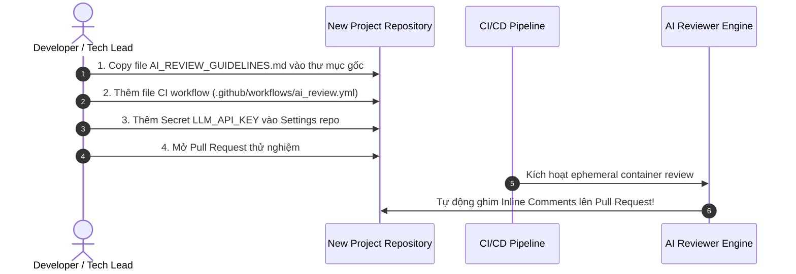

# TÀI LIỆU THIẾT KẾ & HƯỚNG DẪN TRIỂN KHAI HỆ THỐNG AI CODE REVIEW NỘI BỘ (IN-HOUSE CI/CD)

> **Mục tiêu:** Xây dựng giải pháp tự động hóa Code Review bằng AI tích hợp vào quy trình CI/CD nội bộ (GitHub Actions / GitLab CI). Hệ thống được thiết kế theo tiêu chí **100% On-Premise / Zero 3rd-Party SaaS**, bảo mật tuyệt đối mã nguồn, không phát sinh chi phí duy trì cụm server riêng biệt (Zero-Server Overhead), và giải phóng thời gian review cho các Mentor/Tech Lead.

---

## 1. Đánh giá Khách quan & Định hướng Chuyển đổi Kiến trúc

Bản đề xuất sơ khởi ban đầu (sử dụng Neo4j + Vector DB + ReAct Agent) có ý tưởng tốt về mặt **Impact Analysis (Phân tích ảnh hưởng dây chuyền)**, nhưng tồn tại các rào cản lớn khi áp dụng vào môi trường doanh nghiệp nội bộ:

| Tiêu chí | Kiến trúc Sơ khởi (Neo4j + VectorDB) | Rủi ro trong môi trường Doanh nghiệp | Định hướng Kiến trúc Mới (Tinh gọn & Thực tế) |
| :--- | :--- | :--- | :--- |
| **Hạ tầng (Infrastructure)** | Cần duy trì cụm Neo4j Server + Vector DB Server 24/7. | Tăng gánh nặng vận hành cho DevOps; tốn tài nguyên server; nguy cơ downtime DB làm nghẽn toàn bộ CI/CD. | **Zero-Server (Ephemeral Container):** Toàn bộ công cụ đóng gói trong 1 Docker Image, chạy và giải phóng ngay trong CI Runner. |
| **Phân tích Mã nguồn (Code Graph)** | Parse AST bằng Tree-sitter rồi nạp vào Neo4j; sinh câu lệnh Cypher tự do. | AST đơn thuần không giải quyết được Call Graph / Type Inference; Text-to-Cypher dễ hallucinate và treo truy vấn. | **In-memory Graph + Static Indexer:** Dùng Tree-sitter + `networkx` trong RAM hoặc LSP / Pyright CLI để tìm callers/callees tức thì. |
| **Quản lý Quy chuẩn (Guidelines)** | Đưa file guidelines vào Vector DB để làm RAG. | Chunking làm đứt gãy ngữ cảnh quy tắc chéo; tăng thêm 1 DB dependency không cần thiết cho 1 file tài liệu ngắn. | **System Prompt Structuring:** Nạp trực tiếp guidelines vào System Prompt của LLM theo từng tag/domain tương ứng với PR. |
| **Phân bổ Trách nhiệm (Task Delegation)** | Dùng LLM bắt cả lỗi Syntax, PEP 8, Naming convention. | Chậm, tốn chi phí token/GPU nội bộ, dễ báo lỗi giả (false positives). | **2-Tier Pipeline:** Tách lớp Deterministic (Linter/SAST miễn phí) và lớp Semantic (AI chỉ review logic/kiến trúc). |
| **Bảo mật & Bên thứ 3** | Nguy cơ phụ thuộc vào các dịch vụ SaaS bên ngoài. | Vi phạm chính sách bảo mật mã nguồn và IP của doanh nghiệp. | **100% In-house / Self-hosted:** Dùng tool Open-Source CLI + LLM On-Premise (hoặc Private Gateway). |

---

## 2. Kiến trúc Tổng thể: Mô hình Phân tầng (2-Tier Pipeline)

Quy trình được đóng gói hoàn toàn trong một **Ephemeral Docker Container** chạy trên GitLab CI Runner hoặc GitHub Actions Runner nội bộ:



---

## 3. Thiết kế Kỹ thuật Chi tiết (4 Giai đoạn)

### Giai đoạn 1: Deterministic Gate (Kiểm tra Cố định Cục bộ)
Không sử dụng LLM cho các tác vụ kiểm tra cú pháp và định dạng. Tầng này chạy các công cụ CLI mã nguồn mở, offline hoàn toàn:
1. **Linter & Formatter:**
   - **Python:** Sử dụng `ruff` (viết bằng Rust, tốc độ siêu tốc < 50ms, thay thế hoàn toàn `flake8`, `black`, `isort`).
   - **JavaScript/TypeScript:** Sử dụng `eslint` + `prettier`.
2. **Static Application Security Testing (SAST):**
   - Sử dụng **Semgrep OSS** ở chế độ offline (`semgrep scan --config p/security-audit --config p/owasp-top-ten`).
   - Bắt triệt để các lỗi: Hardcoded Secrets, SQL Injection, Command Injection, XSS cơ bản.
3. **Cơ chế Fail-fast:** Nếu tầng này phát hiện lỗi, pipeline dừng ngay và gửi phản hồi cho Dev. LLM sẽ **không** được kích hoạt.

---

### Giai đoạn 2: Phân tích Ảnh hưởng Dây chuyền (In-Memory Impact Analysis)
Thay vì duy trì cơ sở dữ liệu đồ thị Neo4j cồng kềnh, phân tích phụ thuộc được thực hiện ngay trong bộ nhớ RAM của CI runner:
1. **Xác định Vùng thay đổi:**
   - Dùng lệnh `git diff origin/main...HEAD` để bóc tách các file, class, và hàm vừa được thêm mới hoặc chỉnh sửa.
2. **Xây dựng Đồ thị Cục bộ (In-memory Call Graph):**
   - Dùng **Tree-sitter** kết hợp thư viện đồ thị Python `networkx` để parse AST của các file liên quan.
   - Hoặc dùng công cụ index symbol tĩnh như **Universal Ctags** / **Pyright CLI** để truy vết:
     - _Hàm `process_data()` bị sửa đổi ở PR này đang được gọi bởi những hàm/file nào khác?_
     - _Chữ ký hàm (signature) có bị thay đổi gây breaking change ở các module phụ thuộc không?_
3. **Đóng gói Ngữ cảnh (Context Packing):**
   - Chỉ trích xuất phần code của các hàm caller/callee bị ảnh hưởng trực tiếp (tối đa 1-2 bậc) để đưa vào context của LLM. Tránh nhồi toàn bộ codebase làm loãng sự chú ý của mô hình.

---

### Giai đoạn 3: Quản lý và Tinh lọc Bộ Tiêu chuẩn (`AI_REVIEW_GUIDELINES.md`)
Tài liệu hướng dẫn được lưu trữ trực tiếp trong repository, được kiểm soát phiên bản qua Git:
1. **Không dùng Vector DB:** Toàn bộ nội dung file được đọc trực tiếp và tích hợp vào **System Prompt** của LLM.
2. **Phân vùng Tiêu chuẩn (Tagged Guidelines):**
   - Chỉ nạp các quy tắc liên quan đến loại file thay đổi (ví dụ: PR chỉ sửa migration/database thì chỉ nạp quy tắc nhóm `[DATABASE]`, không nạp quy tắc nhóm `[FRONTEND]`).
3. **Cấu trúc Tiêu chuẩn (Format Chuẩn hóa):**
   Mỗi quy tắc bắt buộc phải có đủ 4 yếu tố:
   ```markdown
   ### [RULE-DB-01] Bắt buộc sử dụng Soft Delete cho các Entity cốt lõi
   - **Mô tả:** Không bao giờ gọi hàm `.delete()` trực tiếp trên các model tài chính/người dùng; phải cập nhật trường `is_deleted = True` hoặc `deleted_at`.
   - **Lý do:** Đảm bảo khả năng kiểm toán (audit trail) và phục hồi dữ liệu khi có sự cố.
   - **Bad:**
     user = User.objects.get(id=user_id)
     user.delete()
   - **Good:**
     user = User.objects.get(id=user_id)
     user.soft_delete(deleted_by=request.user)
   ```

---

### Giai đoạn 4: Điều phối Review & Tích hợp Git Nội bộ
1. **Lựa chọn Mô hình LLM (Đảm bảo Không Leak Code):**
   - **Phương án Khuyến nghị (On-Premise GPU):** Triển khai server suy luận nội bộ bằng **vLLM** hoặc **Ollama**.
     - Model ưu tiên: `Qwen2.5-Coder-32B-Instruct` (chất lượng review tương đương GPT-4o, hỗ trợ tiếng Anh & tiếng Việt tốt).
     - Model cho phần cứng vừa phải: `Qwen2.5-Coder-14B-Instruct` hoặc `DeepSeek-Coder-V2-Lite`.
   - **Phương án Doanh nghiệp (Private Enterprise Cloud Gateway):** Nếu công ty có tài khoản Azure OpenAI / GCP Vertex AI với thỏa thuận pháp lý **Zero Data Retention** (dữ liệu không bị lưu trữ hay dùng để train model).
2. **Định dạng Output (Structured Output):**
   - Yêu cầu LLM trả kết quả theo chuẩn **JSON Schema** nghiêm ngặt:
     ```json
     [
       {
         "file_path": "src/services/payment.py",
         "line_number": 42,
         "severity": "CRITICAL",
         "rule_id": "RULE-SEC-03",
         "comment": "Phát hiện thiếu Database Transaction khi thực hiện chuyển tiền. Nếu bước trừ tiền thành công nhưng bước ghi log thất bại, dữ liệu sẽ bị mất đồng bộ.",
         "suggestion": "Bọc khối code này trong `with transaction.atomic():`"
       }
     ]
     ```
3. **Post Inline Comments:**
   - Script CI đọc mảng JSON và gọi API của Git Platform nội bộ:
     - **GitHub:** `POST /repos/{owner}/{repo}/pulls/{pr_number}/reviews` (sử dụng `event: "COMMENT"`).
     - **GitLab:** `POST /projects/{id}/merge_requests/{mr_id}/discussions`.
   - Comment được ghim chính xác vào từng dòng code vi phạm trên giao diện web của PR.

---

## 4. Công nghệ Đề xuất (Tech Stack Nội bộ Tinh gọn)

| Lớp thành phần | Công nghệ Đề xuất | Trạng thái Bản quyền & Bảo mật |
| :--- | :--- | :--- |
| **CI/CD Platform** | GitLab CI / GitHub Actions Self-Hosted Runner | Hệ thống sẵn có của công ty. |
| **Container Engine** | Docker / Kaniko | Đóng gói môi trường thực thi độc lập. |
| **Linter & Formatter** | `ruff` (Python) / `eslint` (Node.js) | Mã nguồn mở (MIT / Apache), chạy offline 100%. |
| **SAST Engine** | `semgrep` CLI (OSS) | Mã nguồn mở (LGPL), chạy offline với rule chuẩn. |
| **AST & Dependency** | `tree-sitter`, `networkx`, `universal-ctags` | Thư viện Python cục bộ, xử lý in-memory. |
| **LLM Inference Engine** | **vLLM** hoặc **Ollama** (chạy trên máy chủ GPU nội bộ) | Mã nguồn mở, quản lý và scale model tự host. |
| **Foundation Model** | `Qwen2.5-Coder-32B-Instruct` / `14B` | Open-weights, thương mại hóa tự do, chuyên sâu về Code. |
| **Git API Client** | `python-gitlab` / `PyGithub` / `requests` | Giao tiếp nội bộ qua Git Token / CI Token. |

---

## 5. Checklist Chuẩn Bị Dành Cho Team & Hạ Tầng (Team Readiness)

Trước khi bắt tay vào triển khai diện rộng, các bộ phận trong team cần chuẩn bị các hạng mục sau:

### A. Đội ngũ DevOps / Hạ tầng (Infrastructure & Security)
- [ ] **Môi trường LLM Server:**
  - *Nếu dùng On-Premise GPU:* Chuẩn bị 1 server có tối thiểu 1 GPU (khuyến nghị RTX 3090/4090 24GB VRAM cho model 14B/32B-AWQ), cài đặt sẵn Docker và `vLLM` hoặc `Ollama`. Mở port nội bộ (ví dụ: `http://llm-gateway.internal:8000/v1`).
  - *Nếu dùng Enterprise Cloud Gateway:* Chuẩn bị API Key của Azure OpenAI / Vertex AI có thỏa thuận pháp lý **Zero Data Retention**.
- [ ] **Tài khoản Bot & Phân quyền Git:**
  - Tạo tài khoản Bot nội bộ (ví dụ: `@ai-code-reviewer-bot`) hoặc sử dụng `GITHUB_TOKEN` / GitLab Project Access Token.
  - Phân quyền: Cần quyền `pull-requests: write` (GitHub) hoặc `Developer` (GitLab) để ghim comment vào PR/MR.
- [ ] **Cấu hình Secret cấp Organization / Project:**
  - Cấu hình Secret trên CI/CD:
    - `LLM_API_KEY` (hoặc `GEMINI_API_KEY`)
    - `LLM_BASE_URL` (nếu dùng endpoint vLLM/Ollama nội bộ)
- [ ] **Docker Base Image:**
  - Build và lưu trữ image `internal-code-reviewer:latest` lên Container Registry nội bộ của công ty (chứa sẵn Python 3.10+, `requests`, `ruff`, `semgrep`).

### B. Tech Lead & Mentor (Quy chuẩn Mã nguồn)
- [ ] **Khởi tạo file `AI_REVIEW_GUIDELINES.md` chuẩn:**
  - Đúc kết 10–15 quy tắc quan trọng nhất mà team thường xuyên nhắc nhở trong các buổi code review trước đây.
  - Viết theo đúng format: `Rule ID`, `Mô tả`, `Lý do`, ví dụ `Bad` và `Good`.
- [ ] **Cấu hình Linter cho từng ngôn ngữ:**
  - Cung cấp file cấu hình `pyproject.toml` (cho `ruff`) hoặc `.eslintrc` (cho JS/TS) chuẩn của dự án để Tầng 1 deterministic hoạt động đồng nhất.

### C. Toàn bộ Developer trong Team (Văn hóa & Đào tạo)
- [ ] **Hiểu đúng vai trò của AI Reviewer:**
  - AI chỉ là **Trợ lý sơ loại (First-pass reviewer)** giúp bắt các lỗi sơ đẳng, leak tài nguyên, và kiểm tra quy chuẩn.
  - Con người (Tech Lead/Peer) vẫn là người duyệt cuối cùng về mặt **logic nghiệp vụ tổng thể và kiến trúc hệ thống**.
- [ ] **Quy ước phản hồi:**
  - Khi AI đưa ra comment sai (False Positive), dev gắn nhãn hoặc comment phản hồi để Tech Lead cập nhật lại file `AI_REVIEW_GUIDELINES.md`.

---

## 6. Quy Trình Onboard Một Dự Án Mới Trong 5 Phút

Khi một dự án mới trong công ty muốn áp dụng hệ thống AI Review, team chỉ cần thực hiện 3 bước đơn giản:



### Bước 1: Sao chép file Guidelines
Copy file mẫu [ci_agent/AI_REVIEW_GUIDELINES.md](ci_agent/AI_REVIEW_GUIDELINES.md) vào thư mục gốc của repository mới. Tùy chỉnh các quy tắc đặc thù của dự án (nếu có).

### Bước 2: Thêm cấu hình CI/CD
Tạo file `.github/workflows/ai_code_review.yml` (hoặc include file `.gitlab-ci-template.yml` chung của công ty):
```yaml
name: AI Code Review

on:
  pull_request:
    types: [opened, synchronize, reopened]
    branches: [main, master, develop]

permissions:
  contents: read
  pull-requests: write

jobs:
  ai-review:
    runs-on: ubuntu-latest
    steps:
      - uses: actions/checkout@v4
        with:
          fetch-depth: 0

      - uses: actions/setup-python@v5
        with:
          python-version: '3.10'

      - name: Install Dependencies
        run: pip install requests ruff

      - name: Run Review Agent
        env:
          GEMINI_API_KEY: ${{ secrets.GEMINI_API_KEY || vars.GEMINI_API_KEY }}
          GITHUB_TOKEN: ${{ secrets.GITHUB_TOKEN }}
        run: |
          python -m ci_agent.main \
            --pr "${{ github.event.pull_request.number }}" \
            --repo "${{ github.repository }}" \
            --base "origin/${{ github.base_ref }}" \
            --api-key "${{ secrets.GEMINI_API_KEY || vars.GEMINI_API_KEY }}"
```

### Bước 3: Cấu hình Secret
Vào **Settings** -> **Secrets and variables** -> **Actions** -> thêm `GEMINI_API_KEY` (hoặc token truy cập LLM nội bộ). Hoàn tất!

---

## 7. Các Bài Học Kinh Nghiệm Thực Chiến (Lessons Learned từ Bản PoC)

Trong quá trình thực nghiệm bản mẫu (PoC) trên repository hiện tại, team đã rút ra các bài học kỹ thuật quan trọng sau:

1. **Tuyệt đối không dùng `event: "APPROVE"` từ GitHub Actions Token:**
   * Mặc định, `GITHUB_TOKEN` bị GitHub cấm gửi hành động `APPROVE` trên PR (gây lỗi `422 Unprocessable Entity`).
   * **Giải pháp:** Bot luôn gửi review dưới dạng **`event: "COMMENT"`**, còn trạng thái đánh giá (`APPROVED` hay `CHANGES_REQUESTED`) được hiển thị bằng Markdown rõ ràng trong nội dung review.
2. **Cơ chế Map Line Number chặt chẽ (Tránh lỗi 422 khi ghim comment):**
   * GitHub chỉ cho phép ghim inline comment vào các dòng code thuộc diff của PR. Nếu AI sinh ra comment ở dòng ngoài diff, API sẽ báo lỗi.
   * **Giải pháp:** Module `git_diff_extractor.py` bóc tách tập hợp `valid_lines` và tự động căn chỉnh/lọc bỏ các comment nằm ngoài vùng thay đổi.
3. **Xử lý linh hoạt các PR chỉ có dòng Xóa (Deletions Only):**
   * Khi PR chỉ xóa code (không có dòng thêm mới `+`), không thể ghim inline comment theo dòng mới.
   * **Giải pháp:** Hệ thống vẫn gửi diff cho LLM đánh giá logic, nhưng chuyển toàn bộ nhận xét vào nội dung tổng quan (Review Summary Body) thay vì cố tạo inline comment rỗng.
4. **Hỗ trợ cả Secrets lẫn Variables:**
   * Trong thực tế, nhiều developer hay nhầm lẫn giữa tab *Secrets* và *Variables* trên GitHub.
   * **Giải pháp:** Workflow hỗ trợ cú pháp `${{ secrets.KEY || vars.KEY }}` để luôn tự động nhận diện giá trị.
5. **Cơ chế Fail-Fast của Tầng 1 giúp tiết kiệm chi phí:**
   * Các lỗi cú pháp Python cơ bản hoặc lộ Secret được `ruff` và regex bắt ngay trong < 1 giây, dừng pipeline ngay lập tức, giúp tiết kiệm 100% token LLM và GPU inference.

---

## 8. Phân Công Trách Nhiệm trong Team (Ma trận RACI)

| Hoạt động | Developer | Tech Lead / Mentor | DevOps / SRE | AI Agent |
| :--- | :---: | :---: | :---: | :---: |
| Mở Pull Request & sửa code theo comment | **R** | I | I | I |
| Xây dựng & chuẩn hóa `AI_REVIEW_GUIDELINES.md` | C | **A / R** | I | I |
| Quản lý hạ tầng GPU / LLM Gateway & CI Runner | I | C | **A / R** | I |
| Kiểm tra cú pháp, convention, secret (Tầng 1) | I | I | I | **R (Tự động)** |
| Phân tích ảnh hưởng & ghim inline comments (Tầng 2) | I | I | I | **R (Tự động)** |
| Phê duyệt cuối cùng để Merge code vào `main` | I | **A / R** | I | I |

*(R: Responsible - Người thực hiện | A: Accountable - Người chịu trách nhiệm chính | C: Consulted - Người tham vấn | I: Informed - Người nhận thông tin)*

---

## 9. Đo Lường Hiệu Quả & Vòng Lặp Cải Tiến (KPIs & Feedback Loop)

Để chứng minh giá trị của hệ thống trước ban giám đốc và các team khác, cần theo dõi 3 chỉ số chính:

1. **Thời gian phản hồi bước đầu (First Feedback Time):**
   * Mục tiêu: < 45 giây sau khi mở PR (thay vì phải đợi mentor rảnh tay sau vài tiếng hoặc vài ngày).
2. **Tỷ lệ phát hiện lỗi sơ đẳng trước khi Mentor vào review (Early Catch Rate):**
   * Mục tiêu: Bắt > 90% các lỗi về bare except, resource leak, thiếu inference mode, và lộ secret.
3. **Tỷ lệ báo lỗi sai (False Positive Rate):**
   * Mục tiêu: Giữ dưới 10%. Nếu một quy tắc bị báo sai liên tục, Tech Lead sẽ cập nhật lại phần ví dụ `Bad`/`Good` trong `AI_REVIEW_GUIDELINES.md` để fine-tune ngữ cảnh cho mô hình.
